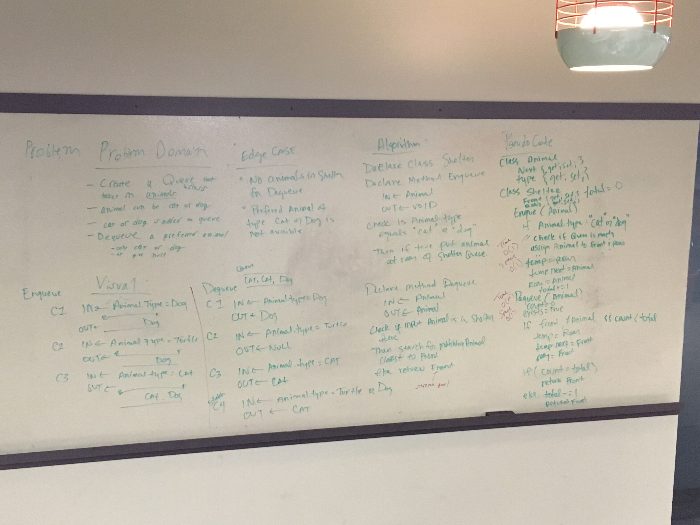

# Animal Shelter

## Challenge
- Create a class called AnimalShelter which holds only dogs and cats. The shelter operates using a first-in, first-out approach.
- Implement the following methods:
    * enqueue(animal): adds animal to the shelter. animal can be either a dog or a cat object.
    * dequeue(pref): returns either a dog or a cat. If a cat or dog isn’t preferred, return whichever animal has been waiting in the shelter the longest.

## Approach & Efficiency

#### Enqueue Method
Time efficiency: O(1) Because the new Animal gets added to the rear, there is no traversal.
Space efficiency: O(1) Becaue the only memory being used is the creation of a new Animal

#### Dequeue Method
Time efficiency: O(n) where n is the number of Animals in the shelter. This method wants to look through the queue for a preferred Animal and this is solved by checking the Front Animal and then putting it at the Rear of the Shelter Queue. However the Queue must hold its place integrity after the method finishes, so the traversal is a For Loop over the Total Number of Animals in the Shelter.

Space efficiency: O(1) Becaue the only memory being used is the creation of a new Animal after the Front is checked. The reason for this is to break the Next chain the Animal in the Front holds. The Front Animal is readied for Garbage and a new Animal is created and assigned to the Rear.

## Solution

