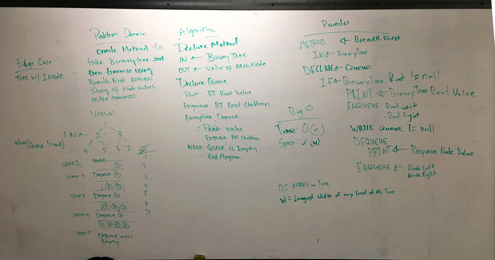

# Breadth First Traversal

## Challenge
- Write a breadth first traversal method which takes a Binary Tree as its unique input. Without utilizing any of the built-in methods available to your language, traverse the input tree using a Breadth-first approach; print every visited node’s value.

## Efficiency

#### Time

O(n) where "n" is the number of nodes in the Binary Tree. In order to print everyone Node we will have to visit every node

#### Space

O(w) where "w" is the widest width of any level of the Binary Tree. Because this traversal uses a Queue to solve a top-down breadth first, the queue will never get any larger than how many nodes are present at any given level of the tree.

## White Board

