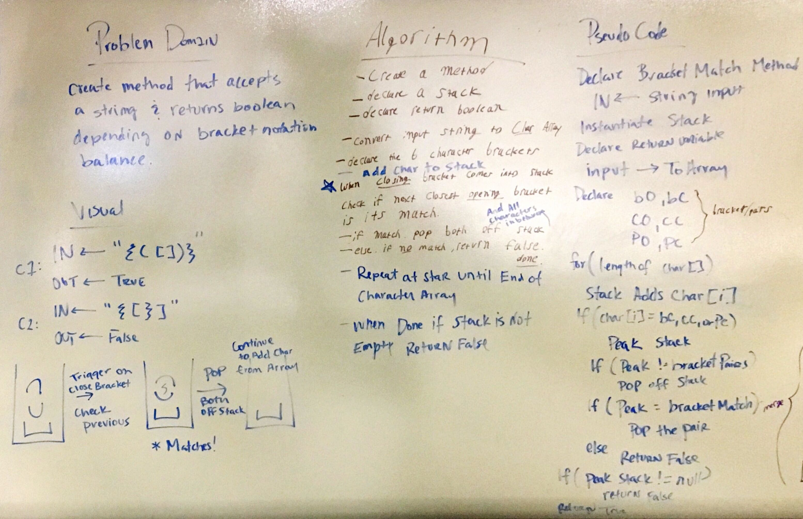

# Multi-Bracket Validation

## Challenge
Your function should take a string as its only argument, and should return a boolean representing whether or not the brackets in the string are balanced. There are 3 types of brackets:

Round Brackets :  ```()```
Square Brackets : ``` []```
Curly Brackets :  ```{}```

## Approach & Efficiency
This problem was solved using a stack. The program iterates over the input string using a ```for loop``` . Any characters that are  ```open```  brackets are added to the stack. Any time a  ```close```  bracket is iterated the program checks if the top of the stack is the ```matching pair```, if its a match then the ```open``` is ```pop()``` off the stack. After the iteration is complete the program checks is anything is left on the stack, if there is something on the stack then ```return false``` otherwise ```return true```.

The matching pairs are stored in tuples:
```c#
var bracket = (open: '[', close: ']');
var curled = (open: '{', close: '}');
var parens = (open: '(', close: ')');
```
##### Time Efficiency O(n)
Inorder for this algorithm to complete in worst case scenario (i.e. on any valid string input) must interate over the entire string and thus ``` n ``` is the characters in the string.

##### Space Efficiency O(1)
No recursion and no new memory is growing.


## Solution

